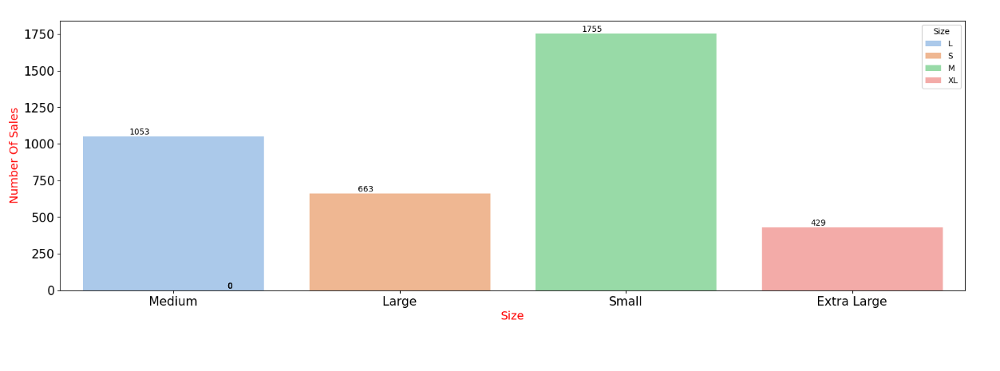

# Customer Shopping Trends

## Purpose of the project 

**The Customer Shopping Trends**  project uses a purchase dataset to analyze and visualize customer shopping behavior. Using the Python libraries Pandas, Seaborn and Matplotlib, this project provides valuable insights into customer buying patterns, frequency and preferences.

## Table of Contents

1. [Introduction](#introduction)
2. [Installation](#installation)
3. [Download Data Set](#download-data-set)
4. [Data Visualization](#data-visualization)


## Introduction

Understanding customer shopping trends is essential for businesses to optimize their strategies and increase customer satisfaction. This project focuses on extracting meaningful insights through cleaning, analyzing, visualizing and grouping customer purchase data.

## Installation

To run this project, Python and the following libraries must be installed:

```bash
pip install pandas seaborn matplotlib
```

## Download Data Set

[You can download the dataset here](https://www.kaggle.com/datasets/iamsouravbanerjee/customer-shopping-trends-dataset?resource=download)


## Data Visualization


*Figure 1: This graph shows the frequency of use of payment methods in the dataset. Each slice represents a payment method. The size of the slice indicates how often that payment method appears in the dataset.*


*Figure 2: When you look at the chart, you can see how many products are in which category. For example, you can see a higher column showing that there are more products in the category “Electronics”. You can also see the total number of products in each category by the numbers above the columns.*

*This chart gives you a quick overview of the distribution of product categories in the dataset. It can be used to see which categories are more concentrated or contain fewer products.*



*Figure 3 :